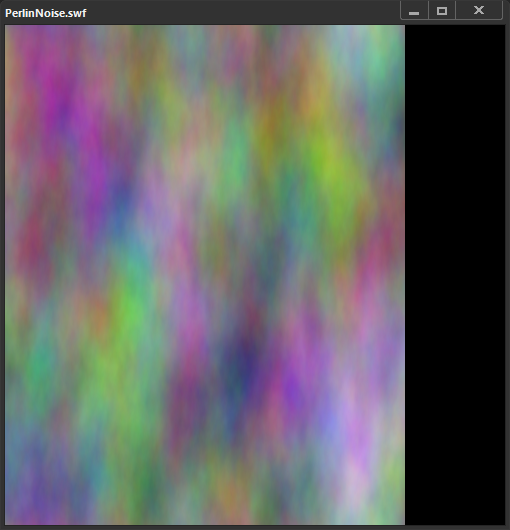
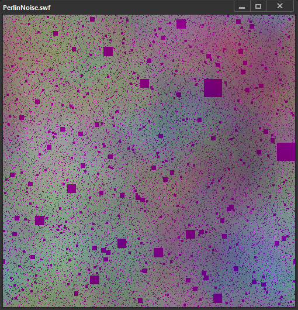

# as3-perlin
Accurate recreation of AS3 perlin noise function

## Accuracy

This library has been tested with over 15k randomly generated Perlin Noises (check the `test` directory for more information).

The only mismatches happened when Flash gave up on rendering the bitmap because there were too many octaves. The library does NOT behave that way, as you have to get every pixel separately with the `generatePerlinNoise` function (whereas Flash does it all at once).



```as
bitmapData.perlinNoise(100, 300, 30, 0, true, true, 7, false);
```

Please note that there is another edge case: for some seeds, Flash Player may divide a vector coordinate by zero, thus causing weird rendering issues. The library behaves the same way, but you could disable this by replacing `INFINITY` to 0 in `perlinNoise.c`. I might add a parameter to toggle this behaviour later, but this library aims to be accurate with Flash Player's implementation.



```as
bitmapData.perlinNoise(500, 500, 16, 346, true, true, 7, false);
```

## Building

This library has no dependencies. You should be able to build it with your preferred C compiler and you can either create a shared library or add it to your project.

It does not export any functions; you might have to add `__declspec(dllexport)` before the 3 functions in `perlinNoise.h` if you wanna build it as a DLL with MSVC. It is probably not be necessary with gcc when building as a shared library.

There is a Python wrapper available in `tests/perlinNoise.py` if you manage to build a shared library.

## Documentation

### initPerlinNoise

```c
perlinState initPerlinNoise(
        uint32_t width, uint32_t height,
        double baseX, double baseY,
        uint32_t numOctaves, int32_t randomSeed,
        bool stitch, bool fractalNoise,
        uint8_t channelOptions, bool grayScale,
        perlinVector2* offsets);
```
        
Initializes a Perlin noise image generator.

The Perlin noise generation algorithm interpolates and combines individual random noise functions (called octaves)
into a single function that generates more natural-seeming random noise.
Like musical octaves, each octave function is twice the frequency of the one before it.
Perlin noise has been described as a "fractal sum of noise" because it combines multiple sets of noise data with different levels of detail.

You can use Perlin noise functions to simulate natural phenomena and landscapes, such as wood grain, clouds, and mountain ranges.
In most cases, the output of a Perlin noise function is not displayed directly but is used to enhance other images and give them pseudo-random variations.

Simple digital random noise functions often produce images with harsh, contrasting points.
This kind of harsh contrast is not often found in nature.
The Perlin noise algorithm blends multiple noise functions that operate at different levels of detail.
This algorithm results in smaller variations among neighboring pixel values.

**Parameters**

- width — Expected width for the output image. Used for the stitch parameter ; otherwise, unused.

- height — Expected height for the output image. Used for the stitch parameter ; otherwise, unused.

- baseX — Frequency to use in the x direction. For example, to generate a noise that is sized for a 64 x 128 image, pass 64 for the baseX value.

- baseY — Frequency to use in the y direction. For example, to generate a noise that is sized for a 64 x 128 image, pass 128 for the baseY value.

- numOctaves — Number of octaves or individual noise functions to combine to create this noise. Larger numbers of octaves create images with greater detail. Larger numbers of octaves also require more processing time.

- randomSeed — The random seed number to use. If you keep all other parameters the same, you can generate different pseudo-random results by varying the random seed value. The Perlin noise function is a mapping function, not a true random-number generation function, so it creates the same results each time from the same random seed.

- stitch — A Boolean value. If the value is true, the method attempts to smooth the transition edges of the image to create seamless textures for tiling as a bitmap fill.

- fractalNoise — A bool value. If the value is true, the method generates fractal noise; otherwise, it generates turbulence. An image with turbulence has visible discontinuities in the gradient that can make it better approximate sharper visual effects like flames and ocean waves.

- channelOptions — A number that can be a combination of any of the four color channel values (0x1 for red, 0x2 for green, 0x4 for blue, 0x8 for alpha). You can use the logical OR operator (|) to combine channel values.

- grayScale — A bool value. If the value is true, a grayscale image is created by setting each of the red, green, and blue color channels to identical values. The alpha channel value is not affected if this value is set to true.
 
- offsetsX — An array of vector2 that correspond to x offsets for each octave. By manipulating the offset values you can smoothly scroll the layers of a perlinNoise image. Each point in the offset array affects a specific octave noise function.

The `offsets` parameter is optional ; when passed, it must contain at least `numOctaves` values, meaning `sizeof(perlinVector2) * numOctaves` bytes.


### generatePerlinNoise

```c
uint32_t generatePerlinNoise(perlinState state, uint32_t x, uint32_t y);
```

Calculates the color for a given coordinate. Return value is the color, as an uint32 in the ARGB format. 

```c
uint8_t alpha = (color >> 24) & 0xFF;
uint8_t red = (color >> 16) & 0xFF;
uint8_t green = (color >> 8) & 0xFF;
uint8_t blue = (color) & 0xFF;
```

### freePerlinNoise

```c
void freePerlinNoise(perlinState state);
```

Frees the allocated buffers and destroy the state. 

## References

Documentation copied from the [ActionScript3 Reference](https://help.adobe.com/en_US/FlashPlatform/reference/actionscript/3/flash/display/BitmapData.html).
